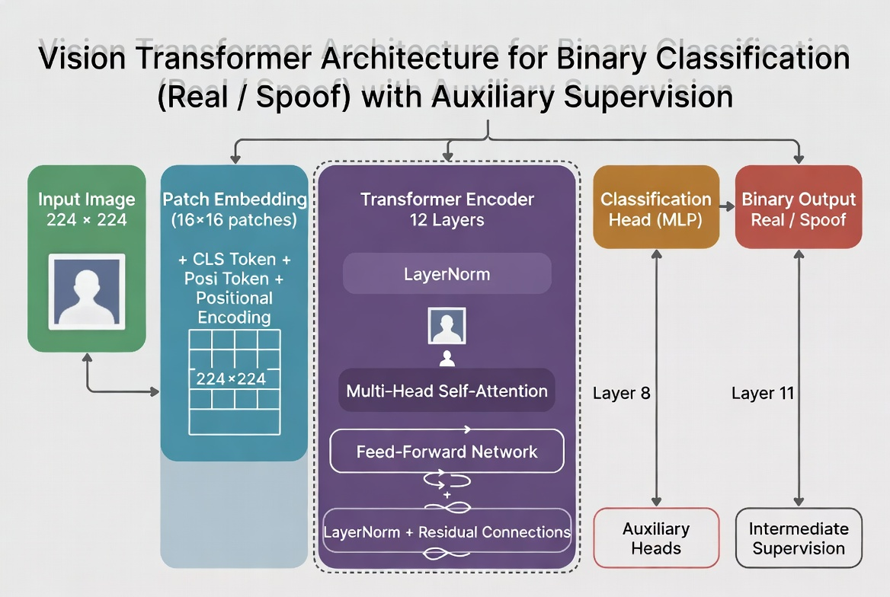

# SpoofFormer: Vision Transformer for Face Anti-Spoofing

A PyTorch implementation of a Vision Transformer (ViT) based face anti-spoofing model with intermediate supervision.



## Quick Start

```bash
# 1. Clone
git clone https://github.com/abdullah-younnis/Face-Anti-Spoofing-Model-based-on-the-SpoofFormer-Architecture.git
cd Face-Anti-Spoofing-Model-based-on-the-SpoofFormer-Architecture

# 2. Create virtual environment
python -m venv .venv
source .venv/bin/activate  # Linux/Mac
# .venv\Scripts\activate   # Windows

# 3. Install package
pip install -e .

# 4. Download dataset
pip install kagglehub
python scripts/download_dataset.py

# 5. Train
python train.py --data_root dataset --model_version tiny --augment strong --epochs 100

# 6. Inference
python inference.py --model checkpoints/best_model.pth --image path/to/face.jpg
```

## Features

- Vision Transformer architecture (ViT-Tiny/Small/Base/Large/Mobile)
- Intermediate supervision for improved training
- Multiple inference backends (PyTorch, ONNX, TorchScript)
- WandB integration for experiment tracking
- Anti-overfitting techniques (strong augmentation, label smoothing, dropout)
- Class imbalance handling (weighted sampling, focal loss)
- YAML-based model configuration

## Training Results

Trained on NUAA dataset (~10k images) with ViT-Tiny and anti-overfitting settings:

| Metric | Value |
|--------|-------|
| Accuracy | 98.97% |
| AUC | 0.9994 |
| Val ACER | 0.0005 |
| Epochs | 42 (early stopped) |

## Model Configurations

| Config | Embed Dim | Heads | Layers | Parameters | Use Case |
|--------|-----------|-------|--------|------------|----------|
| Tiny | 192 | 3 | 12 | ~5M | Small datasets |
| Small | 384 | 6 | 12 | ~22M | Production |
| Base | 768 | 12 | 12 | ~86M | High accuracy |
| Large | 1024 | 16 | 24 | ~307M | Large datasets |
| Mobile | 192 | 3 | 6 | ~2.5M | Edge deployment |

## Installation

```bash
# Clone and setup
git clone https://github.com/abdullah-younnis/Face-Anti-Spoofing-Model-based-on-the-SpoofFormer-Architecture.git

# Create virtual environment
python -m venv .venv
source .venv/bin/activate  # Linux/Mac
# .venv\Scripts\activate   # Windows

# Install package (editable mode)
pip install -e .

# Or install dependencies only
pip install -r requirements.txt
```

## Dataset

### Download NUAA Dataset

The download script automatically downloads, splits (80/20 train/val), resizes to 224x224, and organizes the dataset into the required structure.

```bash
pip install kagglehub
python scripts/download_dataset.py

# Limit images
python scripts/download_dataset.py --max-images 5000

# Synthetic data for testing
python scripts/download_dataset.py --synthetic --synthetic-count 100
```

### Expected Structure

```
dataset/
    train/
        real/
        spoof/
    val/
        real/
        spoof/
```

## Training

### Recommended Training (Small Datasets)

```bash
python train.py \
    --data_root dataset \
    --epochs 100 \
    --model_version tiny \
    --augment strong \
    --label_smoothing 0.1 \
    --dropout 0.3 \
    --balance_classes \
    --focal_loss \
    --early_stopping 20
```

### Basic Training

```bash
python train.py --data_root dataset --epochs 100
```

### List Model Versions

```bash
python train.py --list_versions
```

### With WandB

```bash
pip install wandb
wandb login

python train.py \
    --data_root dataset \
    --epochs 100 \
    --wandb_project spoofformer \
    --wandb_run experiment-1
```

### Training Arguments

| Argument | Default | Description |
|----------|---------|-------------|
| --data_root | dataset | Dataset directory |
| --epochs | 100 | Training epochs |
| --batch_size | 32 | Batch size |
| --lr | 1e-4 | Learning rate |
| --model_version | small | Model version (tiny/small/base/large/mobile) |
| --augment | normal | Augmentation (light/normal/strong) |
| --label_smoothing | 0.0 | Label smoothing (0.1-0.2 recommended) |
| --dropout | None | Override dropout |
| --balance_classes | False | Weighted sampling |
| --focal_loss | False | Use focal loss |
| --early_stopping | 10 | Early stopping patience |

## Inference

Model configuration is auto-detected from checkpoint.

```bash
# PyTorch
python inference.py \
    --model checkpoints/best_model.pth \
    --image path/to/image.jpg

# ONNX
python inference.py \
    --model exports/model.onnx \
    --image path/to/image.jpg \
    --backend onnx

# TorchScript
python inference.py \
    --model exports/model.pt \
    --image path/to/image.jpg \
    --backend torchscript
```

### Output

```
Result:
  Liveness Score: 0.9234
  Prediction: real
  Confidence: 0.8468
  Distance from Boundary: 0.4234
```

| Field | Description |
|-------|-------------|
| Liveness Score | Probability of being real (0.0 = spoof, 1.0 = real) |
| Prediction | "real" or "spoof" based on threshold |
| Confidence | How far from decision boundary, scaled to [0, 1] |
| Distance | Raw distance from threshold (positive = real, negative = spoof) |

Examples with threshold 0.5:

| Score | Prediction | Confidence | Meaning |
|-------|------------|------------|---------|
| 0.92 | real | 0.84 | Very confident real |
| 0.51 | real | 0.02 | Uncertain, barely real |
| 0.10 | spoof | 0.80 | Very confident spoof |

## Model Export

Model configuration is auto-detected from checkpoint.

```bash
# Export both ONNX and TorchScript
python scripts/export_model.py --checkpoint checkpoints/best_model.pth

# ONNX only
python scripts/export_model.py --checkpoint checkpoints/best_model.pth --format onnx

# TorchScript only
python scripts/export_model.py --checkpoint checkpoints/best_model.pth --format torchscript
```

## Docker

### Build

```bash
# CPU (training)
docker build -t spoofformer:latest --target training .

# GPU (training)
docker build -t spoofformer:gpu -f Dockerfile.gpu .

# Inference only (lightweight)
docker build -t spoofformer:inference --target inference .
```

### Run

```bash
# Training (CPU)
docker run \
    -v $(pwd)/dataset:/app/dataset:ro \
    -v $(pwd)/checkpoints:/app/checkpoints \
    -v $(pwd)/configs:/app/configs:ro \
    spoofformer:latest \
    python train.py --data_root dataset --model_version tiny --augment strong --epochs 100

# Training (GPU)
docker run --gpus all \
    -v $(pwd)/dataset:/app/dataset:ro \
    -v $(pwd)/checkpoints:/app/checkpoints \
    -v $(pwd)/configs:/app/configs:ro \
    spoofformer:gpu \
    python train.py --data_root dataset --model_version tiny --augment strong --epochs 100

# Inference
docker run \
    -v $(pwd)/checkpoints:/app/checkpoints:ro \
    -v $(pwd)/configs:/app/configs:ro \
    -v $(pwd)/infer-test:/app/infer-test:ro \
    spoofformer:inference \
    python inference.py --model /app/checkpoints/best_model.pth --image /app/infer-test/real-testing.jpg

# Export model
# Training image contains the full repository.
docker run \
    -v $(pwd):/app \
    spoofformer:gpu \
    python scripts/export_model.py --checkpoint checkpoints/best_model.pth
```

### Docker Compose

```bash
docker-compose run train       # CPU training
docker-compose run train-gpu   # GPU training
docker-compose run inference   # Inference
docker-compose run export      # Export model
```

## Evaluation Metrics

| Metric | Description |
|--------|-------------|
| AUC | Area under ROC curve |
| EER | Equal Error Rate |
| ACER | Average Classification Error Rate |
| APCER | Attack Presentation Classification Error Rate |
| BPCER | Bona Fide Presentation Classification Error Rate |

## Project Structure

```
dir/
├── configs/
│   └── model_configs.yaml          # Model architecture configurations (tiny/small/base/large/mobile)
├── docs/
│   ├── IMPLEMENTATION.md           # Technical implementation details
│   ├── Model-Arch.jpg              # Architecture diagram
│   └── paper_summary.md            # Paper summary document
├── scripts/
│   ├── download_dataset.py         # Dataset downloader and organizer
│   └── export_model.py             # Model export script (ONNX/TorchScript)
├── src/spoofformer/
│   ├── data/
│   │   ├── augmentation.py         # Augmentation utilities
│   │   ├── dataset.py              # FASDataset class
│   │   └── transforms.py           # Light/normal/strong transforms
│   ├── export/
│   │   ├── onnx_export.py          # ONNX export functionality
│   │   ├── quantization.py         # Model quantization
│   │   └── torchscript_export.py   # TorchScript export
│   ├── inference/
│   │   ├── engine.py               # InferenceEngine (PyTorch/ONNX/TorchScript)
│   │   ├── preprocessing.py        # Image preprocessing
│   │   └── result.py               # LivenessResult dataclass
│   ├── models/
│   │   ├── classification_head.py  # Binary classification head
│   │   ├── patch_embedding.py      # Patch embedding layer
│   │   ├── spoofformer.py          # Main SpoofFormer model
│   │   └── transformer.py          # Transformer encoder blocks
│   ├── training/
│   │   ├── metrics.py              # AUC, EER, ACER, APCER, BPCER
│   │   └── trainer.py              # Training loop, WandB, checkpointing
│   └── config.py                   # ModelConfig, TrainingConfig dataclasses
├── tests/
│   ├── conftest.py                 # Pytest fixtures
│   ├── test_config.py              # Config tests
│   └── test_models.py              # Model tests
├── checkpoints/                    # Saved model checkpoints (.pth)
├── exports/                        # Exported models (.onnx, .pt)
├── dataset/                        # Train/val data (gitignored)
├── train.py                        # Training entry point
├── inference.py                    # Inference CLI
├── requirements.txt                # Python dependencies
├── Dockerfile                      # CPU Docker image
├── Dockerfile.gpu                  # GPU Docker image
├── docker-compose.yml              # Docker compose services
├── README.md                       # Project documentation
└── LICENSE                         # MIT License

```

## Testing

```bash
pytest tests/ -v
```

## License

MIT License

## References

- [An Image is Worth 16x16 Words](https://arxiv.org/abs/2010.11929)
- [Deep Learning for Face Anti-Spoofing: A Survey](https://arxiv.org/abs/2106.14948)
- [Focal Loss for Dense Object Detection](https://arxiv.org/abs/1708.02002)
- [Spoof-formerNet: The Face Anti Spoofing Identifier with a Two Stage High Resolution Vision Transformer (HR-ViT) Network](https://www.researchgate.net/publication/394296768_Spoof-formerNet_The_Face_Anti_Spoofing_Identifier_with_a_Two_Stage_High_Resolution_Vision_Transformer_HR-ViT_Network)
